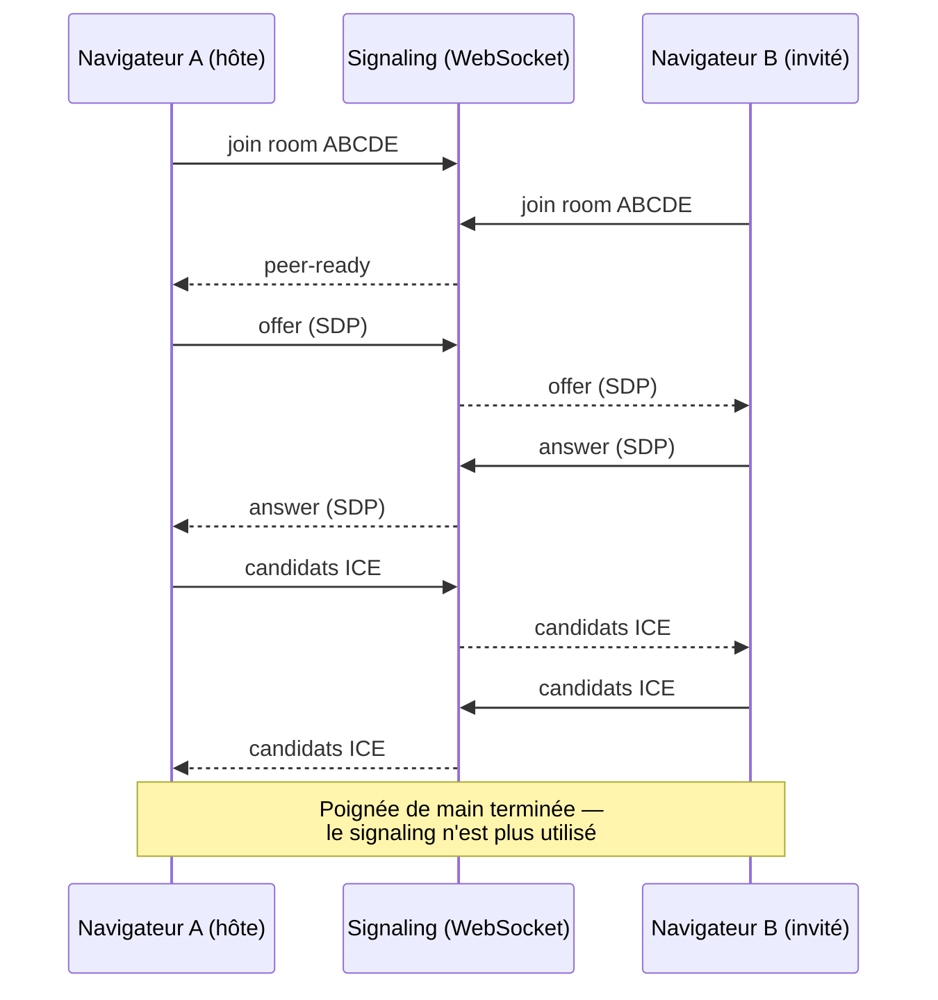
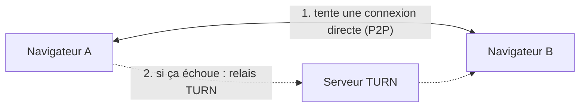

# SnapLover

Une seule photo. À deux, même à distance.

Deux personnes rejoignent une room, activent leur caméra, et prennent une bande photo ensemble :
un compte à rebours 3·2·1 synchronisé déclenche la capture sur les deux écrans au même instant.
Aucun compte requis. Gratuit et open source.

Spécification complète : [`docs/SNAPROOM-SPEC.md`](./docs/SNAPROOM-SPEC.md).

## Pourquoi ce projet

L'idée est partie de [getangie.com](https://getangie.com) : un concept que j'ai trouvé sympa —
prendre une photobooth à deux à distance — mais qui buggait pas mal chez moi, et surtout payant.
Je me suis dit : pourquoi pas le refaire, en gratuit, et en profiter pour apprendre un truc
technique qui me faisait de l'œil depuis un moment. Ça avait l'air fun, je me suis lancé.

Je me suis d'abord documenté sur le WebRTC (je n'y connaissais rien de concret), puis j'ai écrit
un petit test de faisabilité — le dossier [`snaproom-spike/`](./snaproom-spike/) de ce repo, jamais
déployé, gardé comme référence de l'algorithme temps réel. C'est en testant STUN et TURN à ce
moment-là que j'ai compris un truc important : dans certains cas (réseau d'entreprise, NAT
symétrique, etc.), deux navigateurs ne peuvent tout simplement pas se parler en direct — il faut un
serveur relais pour faire transiter le flux entre les deux. J'ai choisi un service qui en propose
gratuitement ([Metered](https://www.metered.ca/tools/openrelay/)) pour ne pas avoir à héberger ça
moi-même dès le début (voir [Turn/relais et coturn](#turn--relais-et-coturn) plus bas — ça pourrait
changer).

Une fois la faisabilité technique validée, j'ai fait passer le design par
[Claude Design](https://claude.ai) pour arriver aux maquettes actuelles (`docs/design/`), puis j'ai
attaqué le code pour de vrai.

## Comment ça marche, techniquement

Le principe central : **la vidéo ne transite jamais par un serveur.** Les deux navigateurs se
parlent directement, en pair à pair (P2P), via WebRTC. Le serveur (`signaling/`) ne sert qu'à la
toute première poignée de main — une fois la connexion établie entre les deux navigateurs, il
n'est plus dans la boucle du tout.

### 1. La poignée de main (signaling)

Chaque navigateur doit d'abord décrire à l'autre ce qu'il sait faire (codecs supportés, etc. — le
SDP, "Session Description Protocol") et où le joindre sur le réseau (les candidats ICE). Ces deux
navigateurs ne se connaissent pas encore l'un l'autre au moment où ils rejoignent la room — il leur
faut un intermédiaire pour échanger ces informations une seule fois. C'est le rôle de
`signaling/` : un simple serveur WebSocket qui relaie ces messages entre les deux pairs d'une même
room, sans jamais toucher à la moindre image ou son.



### 2. La connexion directe (ou le relais, si besoin)

Une fois cette poignée de main faite, les deux navigateurs tentent de s'ouvrir une connexion
**directe** l'un vers l'autre (P2P) — c'est ce que permettent les serveurs **STUN** : ils aident
chaque navigateur à découvrir sa propre adresse publique, pour la partager avec l'autre. Si les
deux réseaux le permettent, la vidéo et les données de la séance (déclenchement synchronisé du
3·2·1, échange des photos capturées) passent directement d'un navigateur à l'autre — jamais par un
serveur.

Mais certains réseaux (NAT symétrique, pare-feu d'entreprise strict…) empêchent cette connexion
directe. Dans ce cas, WebRTC bascule automatiquement sur un serveur **TURN** : un relais qui se
contente de faire transiter le flux chiffré d'un navigateur à l'autre, sans jamais le stocker ni le
regarder.



### 3. Une fois connectés

Toute la logique de la séance (clock-sync pour synchroniser les horloges des deux navigateurs,
déclenchement du compte à rebours, capture de la pose, échange des moitiés de photo, composition de
la bande finale) passe par le **data channel** WebRTC ouvert entre les deux navigateurs — voir
`web/src/lib/realtime/` et `web/src/hooks/use-capture-session.ts`. Aucune de ces données ne
repasse par `signaling/` à ce stade.

### TURN / relais et coturn

Le relais TURN gratuit choisi au départ ([Metered](https://www.metered.ca/tools/openrelay/)) a un
quota limité — en usage réel, la bande passante peut se consommer vite (tout dépend de combien de
sessions passent par un relais plutôt qu'en direct, ce qui dépend surtout du réseau des
utilisateurs). Si ça devient un vrai goulot d'étranglement, l'idée est de migrer vers
[coturn](https://github.com/coturn/coturn) auto-hébergé sur le VPS déjà utilisé pour `signaling/` —
aucun changement de code nécessaire côté app (les identifiants TURN sont déjà lus depuis des
variables d'environnement, voir `web/src/lib/webrtc/turn-credentials.ts`), seulement de
l'infrastructure en plus.

## Stack

- Next.js (App Router) + React 19 + TypeScript strict — `web/`
- Service de signaling WebSocket (Node + `ws`) — `signaling/`
- Tailwind CSS v4 + shadcn/ui (Radix) + Lucide + Framer Motion
- WebRTC (P2P vidéo + data channel), STUN Google + TURN via variables d'environnement
- pnpm workspace, aucune base de données au MVP (rooms éphémères en mémoire)

## Prérequis

- Node.js 18+
- pnpm

## Installation

```bash
pnpm install
```

## Développement

```bash
# Terminal 1 — app web (http://localhost:3000)
cd web
cp .env.example .env
pnpm dev

# Terminal 2 — signaling (ws://localhost:8080)
cd signaling
cp .env.example .env
pnpm dev
```

## Tests

Suite de régression bout en bout (Playwright, 2+ navigateurs headless avec caméra factice) :

```bash
cd e2e
pnpm test
```

Démarre automatiquement `web` et `signaling` sur des ports dédiés (3100/8090) — aucun conflit avec
les serveurs de dev lancés en parallèle.

## Déploiement

Guide complet, étape par étape : [`docs/DEPLOY.md`](./docs/DEPLOY.md).

## Structure

```
snaproom/
├─ web/              # Next.js
├─ signaling/         # service WebSocket
├─ e2e/               # tests de régression bout en bout (Playwright)
├─ deploy/            # docker-compose + config Cloudflare Tunnel pour la prod
├─ snaproom-spike/    # spike de faisabilité (référence, ne pas déployer)
└─ docs/
   ├─ SNAPROOM-SPEC.md   # spécification de référence
   ├─ DEPLOY.md          # guide de déploiement
   └─ design/            # maquettes (.dc.html)
```

Conventions et détails techniques : [`CLAUDE.md`](./CLAUDE.md).
