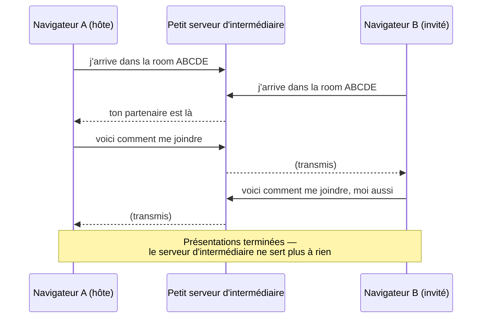
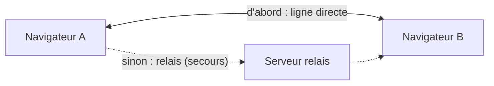

# SnapLover

Faites une bande photo ensemble, même à distance.

Deux personnes rejoignent une room, activent leur caméra, et prennent une bande photo ensemble :
un compte à rebours 3·2·1 synchronisé déclenche la capture sur les deux écrans au même instant.
Aucun compte requis. Une version de base est gratuite, et le cœur technique est open source.

Spécification complète : [`docs/SNAPROOM-SPEC.md`](./docs/SNAPROOM-SPEC.md).

## Pourquoi ce projet

L'idée est partie de [getangie.com](https://getangie.com) : un concept que j'ai trouvé sympa —
prendre une photobooth à deux à distance — mais qui buggait pas mal chez moi, et surtout payant.
Je me suis dit : pourquoi pas le refaire, en gratuit, et en profiter pour apprendre un truc
technique qui me faisait de l'œil depuis un moment. Ça avait l'air fun, je me suis lancé.

Je me suis d'abord renseigné sur comment deux navigateurs peuvent s'échanger de la vidéo en direct
sans passer par un gros serveur au milieu (je n'y connaissais rien de concret avant ça), puis j'ai
écrit un petit test pour voir si c'était vraiment faisable — le dossier
[`snaproom-spike/`](./snaproom-spike/) de ce repo, jamais déployé, gardé comme référence. C'est en
testant ça que j'ai compris un truc important : parfois, deux navigateurs n'arrivent tout
simplement pas à se parler directement (ça dépend du réseau de chacun — un wifi d'entreprise
verrouillé, par exemple). Dans ce cas-là, il faut un serveur qui fasse l'intermédiaire et relaie la
vidéo entre les deux. J'ai choisi un service qui propose ça gratuitement
([Metered](https://www.metered.ca/tools/openrelay/)) pour ne pas avoir à m'en occuper moi-même dès
le début (voir [plus bas](#et-si-la-connexion-directe-ne-marche-pas) — ça pourrait changer).

Une fois que j'ai vu que c'était faisable, j'ai fait passer le design par
[Claude Design](https://claude.ai) pour arriver aux maquettes actuelles (`docs/design/`), puis j'ai
attaqué le code pour de vrai.

## Comment ça marche, en simple

L'idée centrale du projet : **la vidéo ne passe jamais par un serveur.** Les deux navigateurs se
parlent directement l'un à l'autre, comme un appel téléphonique direct plutôt qu'un central qui
écoute et retransmet. Le serveur de ce projet (`signaling/`) ne sert qu'à une chose : aider les
deux navigateurs à se trouver et à démarrer la conversation. Une fois que c'est fait, il ne sert
plus à rien du tout — la vidéo, elle, ne passe jamais par lui.

### 1. Se trouver et se présenter

Au tout début, les deux navigateurs ne se connaissent pas. Ils ont besoin d'un intermédiaire, ne
serait-ce qu'une seule fois, pour échanger deux choses : "voici comment je peux lire/envoyer de la
vidéo" et "voici les façons possibles de me joindre sur le réseau". C'est exactement ce que fait
`signaling/` : un petit serveur qui relaie ces quelques messages entre les deux personnes de la
même room, sans jamais toucher à une seule image ou à un seul son — un peu comme un standard
téléphonique qui met en relation, puis raccroche dès que l'appel est branché.



### 2. Et si la connexion directe ne marche pas ?

Une fois les présentations faites, les deux navigateurs essaient de s'ouvrir une ligne **directe**
entre eux — un peu comme deux personnes qui se donnent rendez-vous puis se retrouvent sans
intermédiaire. Pour ça, chacun a d'abord besoin de connaître sa propre "adresse" sur le réseau —
un petit service public appelé **STUN** l'aide à la découvrir. Si tout se passe bien, la vidéo et
les données de la séance (le compte à rebours, l'échange des photos) passent directement d'un
navigateur à l'autre, sans jamais toucher un serveur.

Mais parfois, certains réseaux (un wifi d'entreprise très verrouillé, par exemple) empêchent cette
ligne directe de s'établir. Dans ce cas, un serveur relais — appelé **TURN** — prend le relais : il
se contente de faire transiter le flux chiffré d'un navigateur à l'autre, sans jamais le stocker ni
le regarder. C'est un peu la solution de secours, utilisée seulement quand le direct est impossible.



### 3. Une fois connectés

Toute la logique de la séance (synchroniser l'horloge des deux navigateurs, déclencher le compte à
rebours, capturer la pose, échanger les deux moitiés de la photo, composer la bande finale) passe
directement entre les deux navigateurs, par ce même canal ouvert à l'étape précédente — voir
`web/src/lib/realtime/` et `web/src/hooks/use-capture-session.ts`. Rien de tout ça ne repasse par
le petit serveur d'intermédiaire à ce stade.

### Le relais gratuit, et l'idée d'en héberger un moi-même

Le service de relais gratuit choisi au départ ([Metered](https://www.metered.ca/tools/openrelay/))
a un quota limité — en usage réel, il peut se remplir assez vite (tout dépend de combien de
personnes passent par le relais plutôt qu'en ligne directe, ce qui dépend surtout de leur réseau).
Si ça devient un vrai frein, l'idée est d'héberger moi-même mon propre relais
([coturn](https://github.com/coturn/coturn)) sur le même serveur que `signaling/` — aucun
changement de code nécessaire côté app (les identifiants sont déjà lus depuis des variables
d'environnement, voir `web/src/lib/webrtc/turn-credentials.ts`), juste un peu plus
d'infrastructure à faire tourner.

### Petit lexique des termes techniques utilisés plus haut

| Terme | Ce que c'est, en une phrase |
| --- | --- |
| **WebRTC** | La techno de navigateur qui permet à deux appareils de s'échanger vidéo/son/données en direct, sans plugin. |
| **P2P** (pair à pair) | Les deux navigateurs se parlent directement entre eux, pas via un serveur central. |
| **Signaling** | Le tout petit échange initial ("voici comment me joindre") qui permet à deux navigateurs de démarrer une connexion WebRTC — assuré ici par `signaling/`. |
| **SDP** | La "carte d'identité" technique qu'échangent les deux navigateurs (codecs supportés, etc.) au moment de se présenter. |
| **ICE candidate** | Une adresse réseau possible pour joindre un navigateur (il peut y en avoir plusieurs : locale, publique, via un relais…). |
| **STUN** | Un service public qui aide un navigateur à découvrir sa propre adresse publique, pour la partager avec l'autre. |
| **TURN** | Un serveur relais utilisé seulement quand la connexion directe échoue — il fait transiter le flux sans le stocker ni le regarder. |
| **Data channel** | Le canal WebRTC utilisé ici pour tout ce qui n'est pas vidéo (déclenchement du compte à rebours, échange des photos, etc.). |

## Stack

- Next.js (App Router) + React 19 + TypeScript strict — `web/`
- Service de signaling WebSocket (Node + `ws`) — `signaling/`
- Tailwind CSS v4 + shadcn/ui (Radix) + Lucide + Framer Motion
- WebRTC (P2P vidéo + data channel), STUN Google + TURN via variables d'environnement
- pnpm workspace, aucune base de données au MVP (rooms éphémères en mémoire)

## Prérequis

- Node.js 18+
- pnpm

## Installation

```bash
pnpm install
```

## Développement

```bash
# Terminal 1 — app web (http://localhost:3000)
cd web
cp .env.example .env
pnpm dev

# Terminal 2 — signaling (ws://localhost:8080)
cd signaling
cp .env.example .env
pnpm dev
```

## Tests

Suite de régression bout en bout (Playwright, 2+ navigateurs headless avec caméra factice) :

```bash
cd e2e
pnpm test
```

Démarre automatiquement `web` et `signaling` sur des ports dédiés (3100/8090) — aucun conflit avec
les serveurs de dev lancés en parallèle.

## Déploiement

Guide complet, étape par étape : [`docs/DEPLOY.md`](./docs/DEPLOY.md).

## Structure

```
snaproom/
├─ web/              # Next.js
├─ signaling/         # service WebSocket
├─ e2e/               # tests de régression bout en bout (Playwright)
├─ deploy/            # docker-compose + config Cloudflare Tunnel pour la prod
├─ snaproom-spike/    # spike de faisabilité (référence, ne pas déployer)
└─ docs/
   ├─ SNAPROOM-SPEC.md   # spécification de référence
   ├─ DEPLOY.md          # guide de déploiement
   └─ design/            # maquettes (.dc.html)
```

Conventions et détails techniques : [`CLAUDE.md`](./CLAUDE.md).
